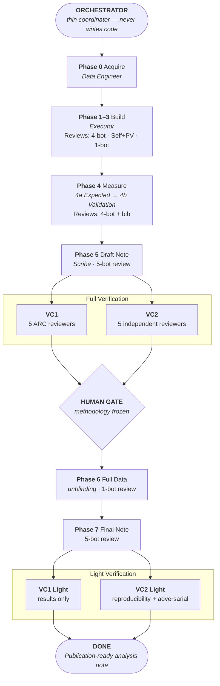

# apexAI — Autonomous Physics Experiment with AI

[](https://www.python.org/)
[](https://claude.ai/claude-code)
[](https://arxiv.org/abs/2603.20179)

An agent framework for autonomous high energy physics analysis. Given a
physics prompt and collision data (or just an experiment name), apexAI plans,
executes, reviews, and documents a publication-quality measurement or search
— from raw ROOT files to a typeset analysis note with full uncertainty budget.

## What it does

1. **Finds and acquires data** from open-data portals (ATLAS, CMS, LEP, Belle, etc.)
2. **Plans the analysis** — backgrounds, systematics, selection approaches, flagship figures
3. **Explores the data** — distributions, invariant mass spectra, feature detection
4. **Implements selection and corrections** — with closure tests, stress tests, approach comparison
5. **Extracts results** — staged unblinding (Asimov → 10% validation)
6. **Writes the draft analysis note** — 50-100 page publication-quality document with PDF
7. **Reviews everything twice** — tiered multi-agent review (A/B/C classification), then two independent verification committees (VC1: 5 ARC specialists, VC2: 5 independent reviewers)
8. **Human gate** — multiple humans judge the AI-verified, VC-endorsed package; methodology frozen on approval
9. **Unblinds on full data** — full statistics with frozen methodology
10. **Produces the final analysis note** — updated with full results and flagship figures
11. **Light VC passes** — VC1 checks results integration, VC2 verifies reproducibility and runs adversarial tests on full data

Every number comes from code running on data. Never from recalled knowledge.

## Key features

- **23 agents, 5 groups** — Execution, Review, Adjudication, and two independent Verification Committees (VC1 + VC2) that never see each other's feedback
- **Staged unblinding** — methodology is frozen before any real data is seen: Asimov dataset, then 10% validation, then full data
- **MemPalace** — persistent semantic memory (ChromaDB + SQLite) that tracks every measured value with provenance, blocking hallucinated numbers
- **Ralph Loop** — autonomous iteration framework with per-phase budgets, progress tracking, and stuck detection
- **Living conventions** — binding domain-specific checklists for each analysis technique (counting, limit-setting, unfolding) that agents must explicitly address
- **Anti-hallucination by design** — 10-point protocol including fits from histograms only, perturbation tests, dual verification, adversarial red-teaming, and full traceability (script:line for every number)

## Architecture



**23 agents** organized into five groups:
- **Execution** (5): Data Engineer, Executor, Note Writer, Fixer, Investigator
- **Review** (6): Physics, Critical, Constructive, Plot Validator, BibTeX, Rendering
- **Adjudication** (2): Arbiter, Typesetter
- **VC1 — Analysis Review** (5): Chair, Data, Selection, Fit, Theory
- **VC2 — Publication Review** (5): Reproduce, Adversarial, CrossAnalyst, Blind, Referee

## Directory guide

```
apexAI/
├── SKILL.md                  Skill trigger and workflow overview
├── core/                     Framework definition
│   ├── phases.md             Phase 0-7 specifications and gates
│   ├── review.md             Review tiers, VCs, regression protocol
│   ├── blinding.md           Staged unblinding protocol
│   ├── orchestration.md      How the orchestrator coordinates agents
│   └── agents/               Agent role definitions (grouped by function)
│       ├── execution.md      Data Engineer, Executor, Note Writer, Fixer, Investigator
│       ├── reviewers.md      Physics, Critical, Constructive, Plot Validator, BibTeX, Rendering
│       ├── adjudication.md   Arbiter, Typesetter
│       ├── vc1.md            Chair, Data, Selection, Fit, Theory
│       └── vc2.md            Reproduce, Adversarial, CrossAnalyst, Blind, Referee
├── standards/                Quality requirements
│   ├── analysis_note.md      AN structure, versioning, completeness
│   ├── plotting.md           Figure production rules
│   ├── coding.md             Git, pixi, code quality
│   └── downscoping.md        When and how to reduce scope
├── techniques/               Analysis methods with code examples
│   ├── fitting.md            Model catalog and decision tree
│   ├── statistics.md         Hypothesis testing, limits, systematics
│   ├── signal_extraction.md  Sideband, ABCD, template methods
│   ├── data_sources.md       Open data portals and download commands
│   └── multichannel.md       Multi-channel combination
├── conventions/              Living operational knowledge per technique
│   ├── README.md             Role in workflow, binding obligations, update process
│   ├── extraction.md         Counting experiments, efficiency/scale-factor extraction
│   ├── search.md             Searches for new physics and limit setting
│   └── unfolding.md          Detector-level to particle-level corrections
├── infrastructure/           Agent tools and operational support
│   ├── mempalace.md          Persistent semantic memory
│   ├── ralph_loop.md         Autonomous iteration framework
│   ├── caveman.md            Terse communication style
│   ├── consultation.md       Second-opinion protocol
│   ├── suggestions.md        Skill evolution framework
│   └── heuristics.md         Agent-maintained tool idioms
├── scripts/                  Executable tooling
│   ├── scaffold.py           Bootstrap a new analysis workspace
│   ├── lint_plots.py         Validate figures against plotting standards
│   └── postprocess_tex.py    Clean up pandoc LaTeX output
└── templates/                Analysis workspace templates
    ├── root.md               Root CLAUDE.md for scaffolded analyses
    ├── phase0.md … phase5.md Per-phase CLAUDE.md templates
    ├── pixi.toml             Starter pixi environment
    └── preamble.tex          LaTeX preamble for analysis notes
```

## Getting started

```bash
# Scaffold a new analysis workspace
python apexAI/scripts/scaffold.py analyses/my_analysis --type measurement
cd analyses/my_analysis

# Set your data path in the generated config
# Edit .analysis_config → set data_dir=/path/to/root/files

# Install the pixi environment (generated by scaffold)
pixi install

# Launch Claude Code — the root CLAUDE.md tells it to orchestrate
claude
```

The scaffolder creates 8 phase directories (`phase0_acquire` through
`phase7_final`), each with `outputs/`, `src/`, `review/`, `logs/`
subdirs. It also generates a root `CLAUDE.md` (orchestrator instructions),
per-phase `CLAUDE.md` files, a `pixi.toml`, `.analysis_config`,
and experiment/retrieval logs.

For autonomous iteration:
```
/ralph-loop "Execute full analysis + verification pipeline. Phase 0-7, then VC1 and VC2. Every number from data." --max-iterations 40 --completion-promise "Both verification committees satisfied"
```

## Provenance & credits

apexAI synthesizes ideas from two complementary frameworks:

- An experiment-agnostic HEP discovery agent with perturbation tests, dual
  verification committees, and persistent semantic memory
- **[JFC (Just Furnish Context)](https://github.com/jfc-mit/jfc)** — a formal
  phased methodology with tiered multi-agent review, phase regression, and
  living conventions

> E. A. Moreno, S. Bright-Thonney, A. Novak, D. Garcia, P. Harris,
> *"AI Agents Can Already Autonomously Perform Experimental High Energy Physics"*,
> [arXiv:2603.20179](https://arxiv.org/abs/2603.20179) (2026)

Neither source was copied. Every file was written from scratch as a genuine
synthesis, organized by what a physicist needs rather than by where the idea
originated.

## Requirements

- [pixi](https://pixi.sh) for environment management
- [Claude Code](https://claude.ai/claude-code) as the agent runtime
- Python >= 3.11
